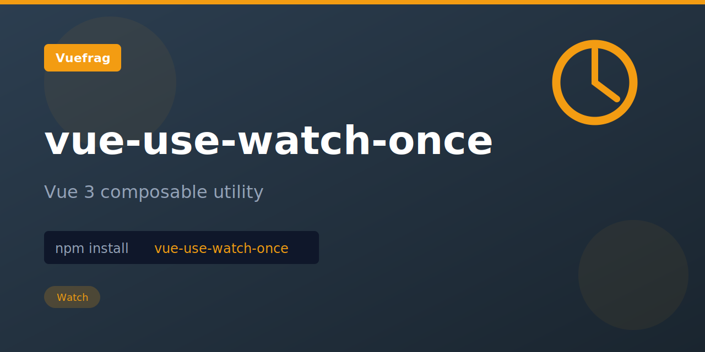

<p align="center">
  
</p>

<h1 align="center">vue-use-watch-once</h1>

<p align="center"></p>

<p align="center">
  <a href="https://www.npmjs.com/package/vue-use-watch-once"></a>
  <a href="https://www.npmjs.com/package/vue-use-watch-once"></a>
</p>

## Installation

```bash
npm install vue-use-watch-once
```

## Usage

Shorthand for watching value with `{ once: true }`. Once the callback fires once, the watcher will be stopped.
See [Vue's docs](https://vuejs.org/guide/essentials/watchers.html#once-watchers) for full details.

Similar to `watch`, but with `{ once: true }`

```ts
import { watchOnce } from 'vue-use-watch-once'

watchOnce(source, () => {
  // triggers only once
  console.log('source changed!')
})
```

## License

MIT

Extracted from [VueUse](https://vueuse.org/) for standalone use.
